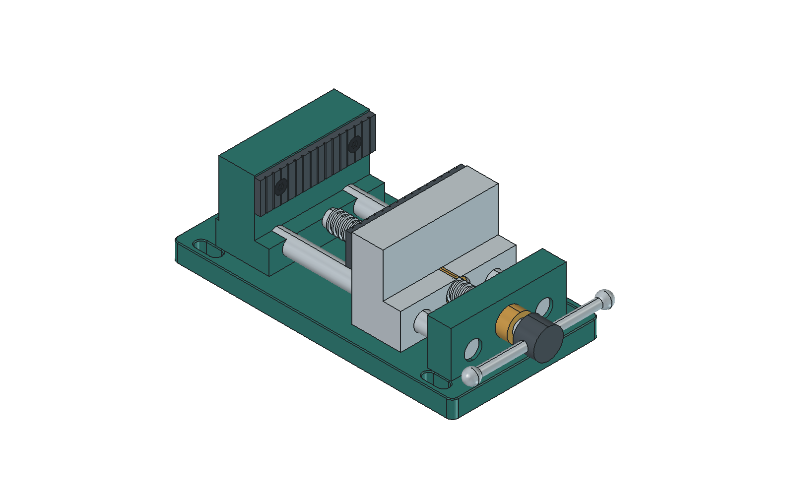

# FreeCAD MCP Server

Ein MCP Server der Claude (und andere AI-Assistenten) direkt mit einer laufenden FreeCAD-Instanz verbindet — mit 136 Werkzeugen für Dokumente, Parameter, Geometrieauswahl, Messung, Sketcher, Part und PartDesign sowie Echtzeit-GUI-Updates. Er deckt eine Auswahl der FreeCAD-API ab, nicht sämtliche Workbenches oder Funktionen.

Stufe 2 ergaenzt `get_capabilities`, `resolve_reference` und `execute_batch`
mit strukturierten Antworten, Vorschau und Rollback. Batch: 1..100 Schritte aus
elf erlaubten Operationen; atomar in einem Dokument oder mit explizitem
Teilstatus ueber mehrere Dokumente.
Stufe 3 ergaenzt 22 strukturierte Werkzeuge fuer Dokumente/Bodies/Gruppen,
typisierte Properties, Spreadsheet/Expressions, Kopien/Links und sichere
Loeschmengen. Fuer neue Workflows `save_document_safe`/`close_document_safe`
verwenden; bestehende Dateien verlangen `overwrite=true`. Das alte
`delete_object` lehnt jetzt referenzierte Objekte ab; dafuer
`preview_delete` und `delete_objects` mit bestaetigter Menge verwenden.
Stufe 4a/4b ergaenzt revisionsgepruefte geometrische Auswahl, Abstand/Winkel,
statische Kontakt-/Interferenzpruefung, GUI-Markierung und dokumentgezielte
Bildaufnahme. Neue Auswahlen nicht nach Aenderungen wiederverwenden; bei
`stale_selection` erneut geometrisch suchen. Alte EdgeN/FaceN-Strings bleiben
ohne Revisionsschutz. Keine kontinuierliche Kollisions- oder Sicherheitszusage.
Stufe 5 ergaenzt Sketch-Geometrie-/Constraint-Bearbeitung, Referenz-/Treibend-
Modi, Solverdiagnosen mit IDs, externe Kanten, Attachment sowie Trim/Extend/
Fillet/Copy/Mirror. Sketch-Koordinaten sind lokal XY; externe Auswahlobjekte
nach jeder Dokumentaenderung neu abfragen. FreeCAD 1.1 unterstuetzt beim Trim
keine einbezogenen Achsen und keine beliebige Spline-Edit-Suite.
Bridge-API 0.6.0; Addon inklusive `document_ops.py`, `geometry_ops.py` und `sketcher_ops.py` gemeinsam aktualisieren
und MCP neu starten. Die Benutzerinstallation wird nicht automatisch geaendert.
Details und Migration: [docs/CONTRACTS.md](docs/CONTRACTS.md).

## Architektur

```
Claude (VS Code / Desktop)
    │ stdio (JSON-RPC / MCP Protocol)
    ▼
MCP Server (Python, FastMCP)         ← src/freecad_mcp/
    │ XML-RPC (localhost:9875)
    ▼
FreeCAD Addon (Workbench)            ← freecad_addon/
    │ Queue → GUI Thread (QTimer)
    ▼
FreeCAD GUI (Live Updates!)
```

## Installation

### 1. FreeCAD Addon installieren

Kopiere den `freecad_addon` Ordner nach FreeCAD's Mod-Verzeichnis:

Den tatsächlich verwendeten Benutzerpfad zeigt `FreeCAD.getUserAppDataDir()` in der FreeCAD-Python-Konsole. Bei FreeCAD 1.1 unter Windows ist er beispielsweise `%APPDATA%\FreeCAD\v1-1\`; ältere Installationen können den unversionierten Pfad verwenden.

```bat
:: Windows (CMD)
xcopy /E /I /Y freecad_addon "%APPDATA%\FreeCAD\v1-1\Mod\FreecadAIBridge"
```

```bash
# Linux
cp -r freecad_addon ~/.FreeCAD/Mod/FreecadAIBridge

# macOS
cp -r freecad_addon ~/Library/Preferences/FreeCAD/Mod/FreecadAIBridge
```

### 2. MCP Server installieren

Im geklonten Root-Verzeichnis des Repos:

```bash
# Virtuelle Umgebung erstellen und aktivieren
python -m venv .venv

# Windows
.venv\Scripts\activate
# Linux / macOS
source .venv/bin/activate

# Abhängigkeiten installieren
pip install -e .
```

### 3. Claude Desktop konfigurieren

Füge in `claude_desktop_config.json` hinzu (siehe `claude_desktop_config.example.json`):

Die Datei befindet sich unter:
- **Windows**: `%APPDATA%\Claude\claude_desktop_config.json`
- **macOS**: `~/Library/Application Support/Claude/claude_desktop_config.json`
- **Linux**: `~/.config/Claude/claude_desktop_config.json`

```json
{
  "mcpServers": {
    "freecad": {
      "command": "python",
      "args": ["-m", "freecad_mcp.server"],
      "env": {
        "PYTHONPATH": "C:\\Users\\<DeinName>\\FreeCad_MCP_Server\\src"
      }
    }
  }
}
```

> **Hinweis:** Passe den `PYTHONPATH` auf den absoluten Pfad zum `src`-Verzeichnis deines geklonten Repos an. Wenn du eine virtuelle Umgebung nutzt, trage statt `python` den vollen Pfad zur Python-Binary ein (z.B. `C:\\Users\\<DeinName>\\FreeCad_MCP_Server\\.venv\\Scripts\\python.exe`).

### 4. VS Code konfigurieren

Die `.vscode/mcp.json` ist bereits im Projekt enthalten — beim Öffnen des Repo-Ordners in VS Code wird der MCP-Server automatisch erkannt. Der `PYTHONPATH` zeigt relativ auf `src/` im Repo.

## Verwendung

1. **FreeCAD starten** — Das Addon startet automatisch den RPC-Server auf Port 9875
2. **Claude verwenden** — Die MCP Tools sind automatisch verfügbar
3. **Erstes Tool aufrufen**: `connect` um die Verbindung herzustellen

### Beispiel-Workflow

```
User: "Erstelle einen Würfel 20x20x20mm mit 2mm Fillet auf allen Kanten"

Claude ruft auf:
1. connect()
2. create_document("MyPart")
3. partdesign_body("Body")
4. create_sketch("Sketch", plane="XY", body_name="Body")
5. sketch_add_rectangle("Sketch", 0, 0, 20, 20)
6. partdesign_pad("Sketch", length=20)
7. partdesign_fillet("Pad", edges=["Edge1","Edge2",...,"Edge12"], radius=2)
8. screenshot(view="isometric")
```

## Verfügbare Tools (136)

### Geometrieauswahl und Analyse (Stufe 4a/4b)

- `list_subelements`, `select_subelement`, `resolve_subelement`: kombinierte
  Typ-/Lage-/Richtungs-/Radius-/Groessenfilter, explizite Dokumente, mm/Grad,
  konservative Revisionspruefung statt stiller Kantenneuzuordnung.
- `measure_distance`, `measure_angle`, `check_interference`: endliche BReps,
  Linien-/Ebenenwinkel und getrennte Kennwerte fuer Abstand/Schnittvolumen.
- `highlight_subelements`, `get_view_state`, `capture_view`: GUI-Auswahl,
  Darstellungswerte und sieben gezielte Ansichten als native MCP-PNGs.
  Markierung und PNG-Inhalt sind getrennt; saveImage kann Hervorhebung ausblenden.
- Part-/PartDesign-Dress-ups akzeptieren ausgegebene Auswahlobjekte direkt
  in edges/faces; Batches behalten ihre bisherige begrenzte API.

### Dokumentbearbeitung und Parameter (Stufe 3)

- `inspect_document`, `activate_document`, `recompute_document`, `save_document_safe`, `close_document_safe`
- `create_container`, `set_container_members`, `set_body_tip`
- `get_properties`, `set_properties`, `get_expressions`, `set_expression`
- `create_spreadsheet`, `read_spreadsheet`, `set_spreadsheet_cells`, `set_spreadsheet_alias`
- `rename_object`, `copy_object`, `create_link`, `get_dependencies`, `preview_delete`, `delete_objects`

Neue Werkzeuge verlangen explizite Dokumentnamen und liefern `ContractResponse`;
immer `status` pruefen. MCP-Abnahme: `python tests/mcp_smoke.py --stage3-only`
gegen eine leere isolierte Workspace-Bridge mit `FREECAD_TEST_PORT`.

### Verbindung & Dokumente (12)

- `connect`, `get_status`, `get_capabilities`, `resolve_reference`
- `execute_batch` (mit `preview=true` fuer nichtmutierende Vorschau)
- `create_document`, `open_document`, `save_document`, `close_document`
- `list_objects`, `inspect_object`, `delete_object`

### Sketcher Geometrie und Bearbeitung (22)
- `create_sketch`
- `sketch_add_line`, `sketch_add_rectangle`, `sketch_add_circle`
- `sketch_add_arc`, `sketch_add_ellipse`, `sketch_add_bspline`
- `sketch_add_point`, `sketch_add_polygon`, `sketch_add_slot`
- `sketch_move_point`, `sketch_set_construction`, `sketch_delete_geometry`
- `sketch_add_external`, `sketch_delete_external`, `sketch_set_attachment`
- `sketch_trim`, `sketch_extend`, `sketch_fillet`, `sketch_copy`, `sketch_mirror`
- `sketch_info`

### Sketcher Constraints (24)
- `sketch_constrain_coincident`, `sketch_constrain_tangent`
- `sketch_constrain_perpendicular`, `sketch_constrain_parallel`
- `sketch_constrain_equal`, `sketch_constrain_symmetric`
- `sketch_constrain_horizontal`, `sketch_constrain_vertical`
- `sketch_constrain_lock`, `sketch_constrain_block`
- `sketch_constrain_distance`, `sketch_constrain_distance_x`, `sketch_constrain_distance_y`
- `sketch_constrain_angle`, `sketch_constrain_radius`
- `sketch_constrain_length`, `sketch_constrain_distance_x_between`, `sketch_constrain_distance_y_between`
- `sketch_constrain_angle_to_axis`, `sketch_constrain_diameter`, `sketch_constrain_point_on_object`
- `sketch_set_constraint_value`, `sketch_set_constraint_mode`, `sketch_delete_constraint`

### PartDesign Features (17)
- `partdesign_body`, `partdesign_pad`, `partdesign_pocket`
- `partdesign_revolution`, `partdesign_groove`
- `partdesign_loft`, `partdesign_sweep`
- `partdesign_subtractive_loft`, `partdesign_subtractive_pipe`
- `partdesign_hole`
- `partdesign_fillet`, `partdesign_chamfer`
- `partdesign_thickness`, `partdesign_draft`
- `partdesign_linear_pattern`, `partdesign_polar_pattern`, `partdesign_mirrored`

### Part Primitives, Boolean & Kanten (10)
- `part_box`, `part_cylinder`, `part_sphere`, `part_cone`, `part_torus`
- `boolean_fuse`, `boolean_cut`, `boolean_common`
- `part_fillet`, `part_chamfer`

### Transform (5)
- `set_placement`, `move_object`, `rotate_object`, `scale_object`, `mirror_object`

### View & Visualisierung (6)
- `screenshot`, `set_view`, `fit_view`
- `set_visibility`, `set_color`, `set_transparency`

### Export/Import (5)
- `export_step`, `export_stl`, `export_obj`, `import_step`, `import_stl`

### Utilities (4)
- `measure`, `undo`, `redo`, `execute_python`

## Konfiguration

Das Addon kann über FreeCAD-Preferences konfiguriert werden:

- **Port**: Standard 9875 (änderbar in `User parameter:BaseApp/Preferences/Mod/FreecadAIBridge`)
- **Host**: Standard 127.0.0.1 (nur lokal)
- **AutoStart**: Standard True

## Sicherheit

- Der RPC-Server erzwingt eine lokale Loopback-Adresse und hat keine Authentifizierung. Nur vertrauenswürdige lokale Clients zulassen; den Port nicht weiterleiten.
- Funktionsaufrufe sind auf öffentliche, im Addon definierte Operationen beschränkt. Fremde Module und private Hilfsfunktionen sind gesperrt.
- `execute_python` führt vertrauenswürdigen Python-Code mit den Rechten von FreeCAD aus. Der Textfilter blockiert einige offensichtliche Befehle, ist aber **keine Sandbox** und keine Sicherheitsgrenze.
- Öffnen, Speichern und Exportieren dürfen lokale Dateien lesen beziehungsweise überschreiben. Pfade vor dem Aufruf prüfen.

## Bekannte Einschränkungen

- FreeCAD muss laufen (kein headless Mode für GUI-Updates)
- Topology Naming Problem: Edge/Face-Namen können sich nach Recompute ändern
- Thread-Safety wird durch Queue-Pattern sichergestellt (kein direkter Zugriff)
- Kein FEM-Support in v1 (erweiterbar)
- Kein Assembly-Workbench Support (zu experimentell)
- PartDesign-Loft/-Sweep erzeugen Volumenkörper; `solid=False` wird ausdrücklich abgelehnt.
- `partdesign_draft` benötigt `plane_name`, etwa `Pad.Face6` oder den Namen einer Bezugsebene.
- Musterachsen und -ebenen beziehen sich auf den Ursprung des jeweiligen Bodys.
- RPC-Modellieroperationen in bestehenden Dokumenten unterstützen Undo/Redo und Rollback bei Fehlern. Freie Python-Skripte müssen ihre Transaktionen selbst verwalten.
- Bei Zeitüberschreitungen werden noch nicht gestartete Aufträge verworfen. Bereits laufende CAD-Berechnungen können weiterlaufen; vor Wiederholung den Dokumentzustand prüfen.
- Standardexport: sichtbare Endergebnisse, keine ausgeblendeten Zwischenfeatures oder doppelten Body-Tips. `obj_names=[]` ist eine leere Auswahl und ergibt einen Fehler.
- `screenshot` liefert nativen MCP-Bildinhalt. `set_placement(rx, ry, rz)` verwendet X-/Y-/Z-Winkel, angewandt in dieser Reihenfolge.

## Tests und Prüfstand

Geprüft mit FreeCAD 1.1 unter Windows. Befunde, Änderungen und Grenzen stehen im [Prüfbericht](docs/AUDIT.md).

```powershell
python -m unittest discover -s tests -p "test_*.py" -v
```

Für isolierte Live-Tests eine zusätzliche FreeCAD-Instanz mit [tests/start_bridge.FCMacro](tests/start_bridge.FCMacro) öffnen. Diese lädt das Addon direkt aus dem Workspace und lauscht auf Port **9876**. Danach:

```powershell
python tests/mcp_smoke.py
```

Die CAD-Tests werden innerhalb dieser FreeCAD-Instanz ausgeführt, beispielsweise über `connect(port=9876)` und `execute_python`:

```python
import runpy
result = runpy.run_path("D:/Proj/FreeCad/FreeCad_MCP_Server/tests/freecad_integration.py")["run_tests"]()
```

Den absoluten Repository-Pfad bei Bedarf anpassen. `run_tests(pattern="test_export*")` führt nur einen Teilbereich aus. Die Tests legen eigene Dokumente an und schließen sie anschließend wieder.

Nach Addon-Updates FreeCAD neu starten; nach Änderungen am MCP-Werkzeugangebot auch den MCP-Server im Client neu starten.

## Beispielmodell: Präzisions-Schraubstock



- [Editierbares FreeCAD-Modell](examples/Praezisions_Schraubstock_MCP.FCStd)
- [STEP-Baugruppe](examples/Praezisions_Schraubstock_MCP.step) und [STL](examples/Praezisions_Schraubstock_MCP.stl)
- [Reproduzierbares Modellskript](models/praezisions_schraubstock.py)

17 gültige Einzelkörper, 18 vollständig bestimmte Skizzen und eine Grundplatte von 190 × 100 mm. Enthalten sind Spannlanglöcher, gezahnte Backen, Führungswellen, eine vereinfachte trapezförmige Gewindehelix und ein Knebelgriff. Parametrische Bodies und Features sind editierbar; nicht alle Abmessungen sind global miteinander verknüpft. Das Modell ist eine CAD-Demonstration, keine belastungsgeprüfte Fertigungszeichnung.

In FreeCAD lässt es sich mit `runpy.run_path(".../models/praezisions_schraubstock.py")["build_model"]()` neu erzeugen. Für RPC-Aufrufe mit kurzen Timeouts die Funktionen `build_frame`, `build_details`, `build_spindle` und `save_model` nacheinander aus demselben importierten Modul aufrufen.

## GitHub Copilot verwenden

Das Projekt lässt sich auch direkt mit **GitHub Copilot** (VS Code) nutzen. Die `.vscode/mcp.json` ist bereits im Repo enthalten und registriert den FreeCAD-MCP-Server automatisch.

### Voraussetzungen

- VS Code mit der Erweiterung **GitHub Copilot** (≥ v1.99) oder **GitHub Copilot Chat**
- MCP-Unterstützung ist in VS Code ab Version 1.99 integriert (Agent Mode)

### Einrichtung

1. Repo in VS Code öffnen
2. Virtualenv aktivieren und `pip install -e .` ausführen (siehe [Installation](#installation))
3. FreeCAD starten (Addon muss geladen sein, RPC-Server auf Port 9875)
4. In VS Code den **Copilot Chat** öffnen und in den **Agent Mode** wechseln (Dropdown oben im Chat-Fenster → „Agent")
5. Die FreeCAD-Tools erscheinen automatisch — einfach loslegen:

```
@workspace Erstelle in FreeCAD einen Zylinder mit Durchmesser 30mm und Höhe 50mm
```

> **Hinweis:** `mcp.json` setzt `PYTHONPATH` automatisch auf `${workspaceFolder}/src`, es ist kein manueller Eintrag nötig.

## Lizenz

MIT License — Copyright (c) 2026 JakobThiessen

Siehe [LICENSE](LICENSE) für den vollständigen Lizenztext.
